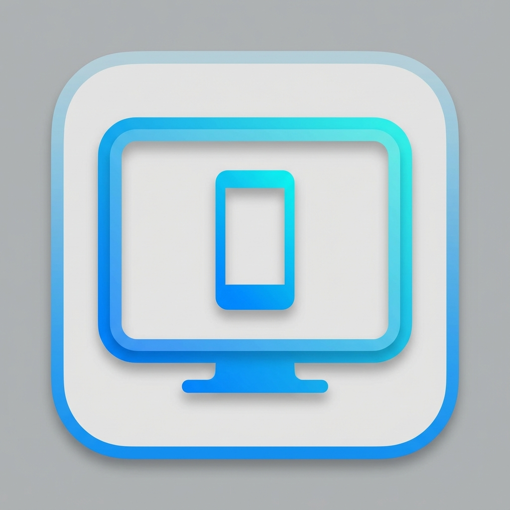

# scrcpy-gui

<p align="center">
  
</p>

<p align="center">
  <strong>Cross-platform desktop GUI for <a href="https://github.com/Genymobile/scrcpy">scrcpy</a> with native look and feel</strong>
</p>

<p align="center">
  <a href="https://github.com/rifqiabd/scrcpy-gui/actions"></a>
  <a href="LICENSE"></a>
  <a href="https://github.com/rifqiabd/scrcpy-gui/releases"></a>
  
  
</p>

---

## ✨ Features

- 📱 **Auto-detect Android apps** - Automatically list installed Android apps via ADB
- 🚀 **One-click launch** - Launch scrcpy for specific apps with a single click
- ➕ **Manual app entry** - Add custom apps that aren't auto-detected
- 💾 **Persistent storage** - Save your custom apps in a config file
- 🎨 **Native UI** - Qt-based interface with native look on Windows, macOS, and Linux
- 🔄 **Multi-window** - Open multiple scrcpy instances simultaneously
- ⌨️ **Keyboard shortcuts** - Quick access via Ctrl+R (refresh), Ctrl+N (add), Ctrl+Q (quit)
- 🎯 **User-friendly** - Clean interface with helpful error messages

## 📋 Requirements

- **Qt 6.x** - Qt framework for GUI
- **CMake 3.16+** - Build system
- **C++17 compiler** - GCC, Clang, or MSVC
- **ADB** (Android Debug Bridge) - Must be in PATH
- **scrcpy** - Must be in PATH

## 🚀 Quick Start

### Install Dependencies

#### Linux
```bash
sudo apt install qt6-base-dev cmake build-essential adb scrcpy
```

#### macOS
```bash
brew install qt@6 cmake android-platform-tools scrcpy
```

#### Windows
1. Install [Qt 6.x](https://www.qt.io/download-dev)
2. Install [CMake](https://cmake.org/download/)
3. Install [ADB Platform Tools](https://developer.android.com/studio/releases/platform-tools)
4. Install [scrcpy](https://github.com/Genymobile/scrcpy/releases)

### Build from Source

```bash
# Clone the repository
git clone https://github.com/rifqiabd/scrcpy-gui.git
cd scrcpy-gui

# Create build directory
mkdir build && cd build

# Configure and build
cmake ..
make

# Run
./scrcpy-gui
```

For detailed build instructions, see [BUILD.md](BUILD.md).

## 📖 Usage

1. **Connect your Android device** via USB with USB debugging enabled
2. **Launch the application** - The app will automatically scan for installed apps
3. **Click on an app** to launch scrcpy in a new window
4. **Add custom apps** using the "Manual Add" button if needed
5. **Use keyboard shortcuts** for quick actions:
   - `Ctrl+R` - Refresh app list
   - `Ctrl+N` - Add new app manually
   - `Ctrl+Q` - Quit application

## 📁 Project Structure

```
scrcpy-gui/
├── src/                    # Source files
│   ├── main.cpp           # Entry point
│   ├── mainwindow.*       # Main window UI
│   ├── scrcpywindow.*     # Scrcpy process window
│   └── appmanager.*       # ADB/app management
├── ui/                    # Qt Designer UI files
│   └── mainwindow.ui      # Main window layout
├── resources/             # Icons and assets
│   └── icon.png          # Application icon
├── docs/                  # Documentation
│   ├── ARCHITECTURE.md    # Architecture details
│   ├── DEVELOPMENT.md     # Development guide
│   └── config.example.json # Example config
├── .github/               # GitHub specific files
│   ├── workflows/         # CI/CD workflows
│   └── ISSUE_TEMPLATE/    # Issue templates
├── CMakeLists.txt         # Build configuration
├── LICENSE                # MIT License
└── README.md             # This file
```

## 🏗️ Architecture

See [ARCHITECTURE.md](./docs/ARCHITECTURE.md) for detailed architecture documentation.

**Key Components:**
- **MainWindow** - UI layer for app list and controls
- **AppManager** - Business logic for ADB integration and config management
- **ScrcpyWindow** - Display layer for managing scrcpy processes

## 🛠️ Development

Want to contribute? Check out [CONTRIBUTING.md](CONTRIBUTING.md) and [DEVELOPMENT.md](docs/DEVELOPMENT.md).

This project uses Cursor IDE for AI-assisted development. See `.cursorrules` for coding standards.

## 🐛 Troubleshooting

### ADB not found
Ensure ADB is installed and in your PATH:
```bash
adb version  # Should show version number
```

### Scrcpy not found
Install scrcpy and make sure it's in your PATH:
```bash
scrcpy --version  # Should show version number
```

### No apps detected
- Ensure Android device is connected via USB
- Enable USB debugging in Developer Options
- Accept the USB debugging authorization prompt on your device
- Check device is detected: `adb devices`

For more help, see [DEVELOPMENT.md](docs/DEVELOPMENT.md) or open an issue.

## 📄 License

This project is licensed under the MIT License - see the [LICENSE](LICENSE) file for details.

## 🙏 Acknowledgments

- [scrcpy](https://github.com/Genymobile/scrcpy) - The amazing screen mirroring tool this GUI wraps
- [Qt Framework](https://www.qt.io/) - For the cross-platform GUI framework
- All contributors who help improve this project

## 🔗 Related Projects

- [scrcpy](https://github.com/Genymobile/scrcpy) - Display and control Android devices
- [QtScrcpy](https://github.com/barry-ran/QtScrcpy) - Another Qt-based scrcpy GUI

## 🤝 Contributing

Contributions are welcome! Please read [CONTRIBUTING.md](CONTRIBUTING.md) for details on our code of conduct and the process for submitting pull requests.

